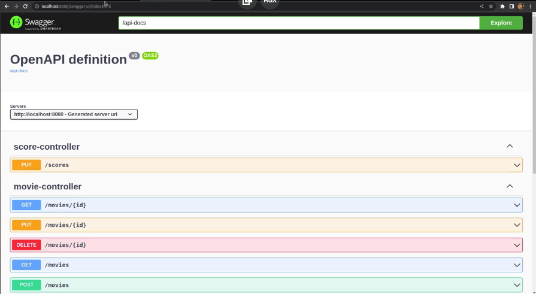
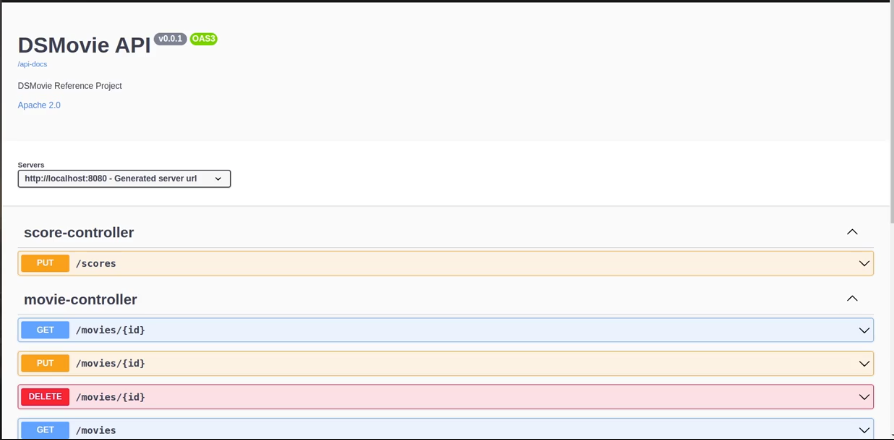
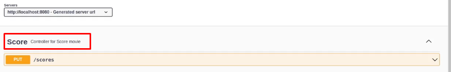
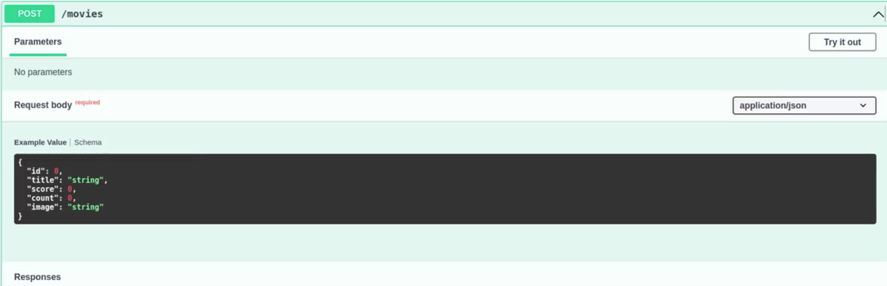
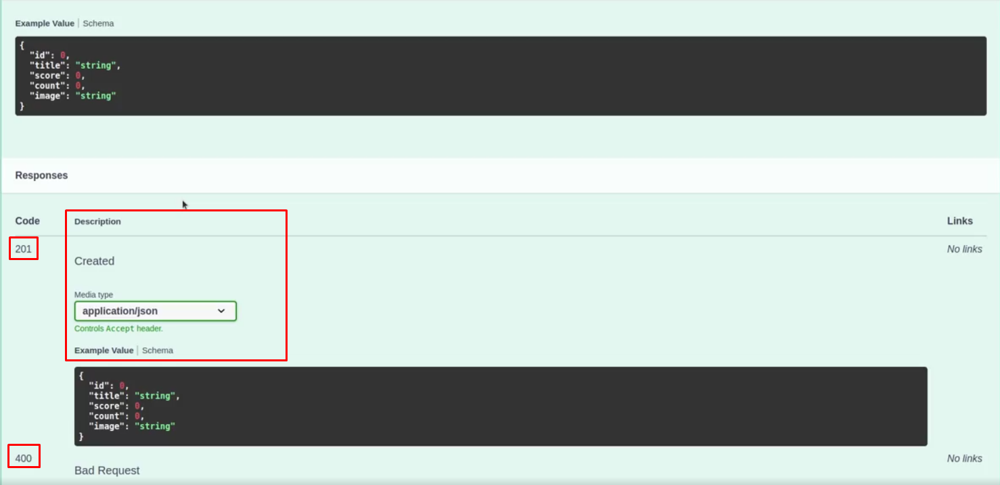
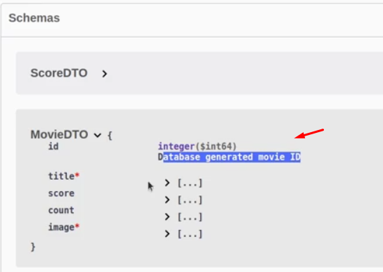
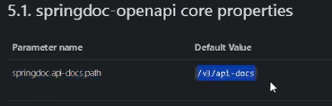
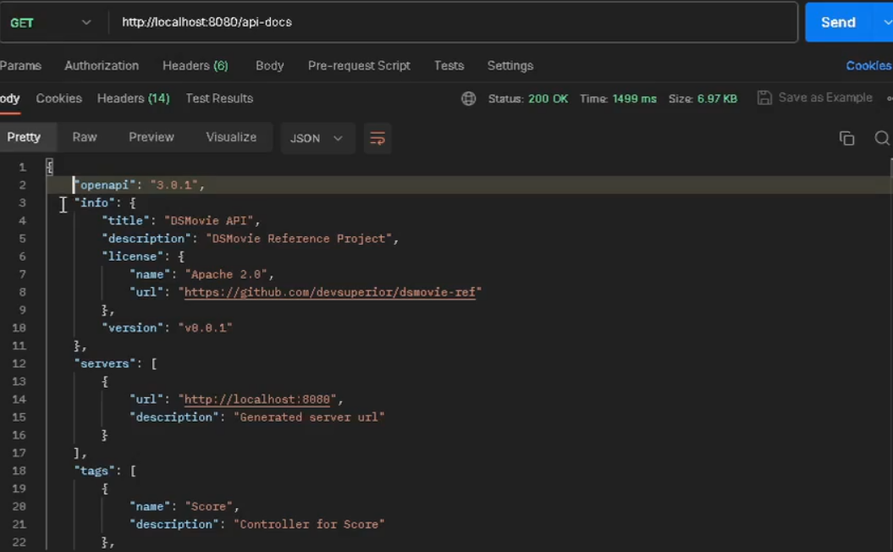
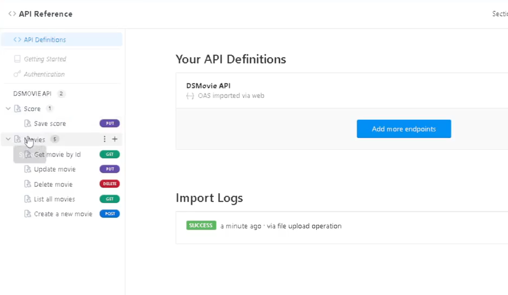

# Documentação de API com Swagger e OpenAPI 3.0 no Spring Boot com Java

# Objetivo

Criar uma documentação para o projeto Dsmovie usando Swagger e OpenAPI 3.0

# Introdução

## Definição de documentação

Quando falamos documentação/documentar, nós queremos dizer representar (normalmente em texto), uma descrição dos
principais aspectos do produto ou serviço, permitindo consulta e validação das partes envolvidas.

### Por quê documentar uma API?

1. Auxiliar os usuários da API a entenderem seus recursos.

Mostrar, por exemplo, parâmetros utilizados, tipo de retorno de dados (JSON/XML).

2. Abstrair detalhes da API.

O que é necessário trazer de essencial para o usuário que irá usufruir da aplicação. 

3. Servir de referência para o time.

Para sistemas grandes, para ter uma consulta, é bem necessário ter uma documentação robusta da aplicação para existir
referências.

### Formas de Documentar

#### Manual

É recomendada para pequenas APIs; (Ex: readme github)

Em sistemas maiores, este processo é muito trabalhoso e demorado.

#### Documentação a partir de ferramentas

Agiliza o processo de documentação, além disso, mantém a API **sempre atualizada e padronizada**!

### Especificações de documentação

Um conjunto de regras que vaõ guiar o processo de documentar a API.

- Descrição da funcionalidade;
- Parâmetros de entrada utilizados;
- Formato da requisição/resposta;
- Status code esperado;
- Requerimento ou não de autenticação.

Quando falamos de REST API, a principal especificação é o OpenAPI.

Aprenderemos a frente sobre [Swagger](https://swagger.io) e [Readme](https://readme.com).

### Passo 1: Dependência maven

```xml
<dependency>
    <groupId>org.springdoc</groupId>
    <artifactId>springdoc-openapi-starter-webmvc-ui</artifactId>
    <version>2.1.0</version>
</dependency>
```
Referência: https://springdoc.org/

Ao adicionar essa dependência e rodar o projeto, se abrirmos a url: ``localhost:8080/swagger-ui.html``, ele irá carregar 
a base da nossa documentação (a ser customizada).



### Passo 2: Classe de configuração

Para customizarmos a nossa documentação, precisamos de uma classe de configuração.

- Incluir a classe OpenAPIConfig no pacote config:

```java
@OpenAPIDefinition
@Configuration
public class OpenApiConfig {

    @Bean
    public OpenAPI dsmovieAPI() {
        return new OpenAPI()
           .info(new Info()
           .title("DSMovie API")
           .description("DSMovie Reference Project")
           .version("v0.0.1")
           .license(new License()
           .name("Apache 2.0")
           .url("https://github.com/devsuperior/dsmovie-ref")));
    }
}
```

⬆️ Veja a url dentro do método.

A partir disso, a nossa documentação começa a tomar forma (veja o nome mudando).



### Passo 3: Acessar documentação

- Link: http://localhost:8080/swagger-ui.html

## Tópicos avançados - Recursos no Swagger

### Passo 1: Personalizar o swagger


- Incluiremos anotações nos recursos (controllers)

```java
@Tag(name = "Movies", description = "Controller for Movie")
public class MovieController {
```

Resultado:



- Anotações nos endpoints REST

```java
@Operation(
    description = "Create a new movie",
    summary = "Create a new movie",
    responses = {
         @ApiResponse(description = "Created", responseCode = "201"),
         @ApiResponse(description = "Bad Request", responseCode = "400"),
         @ApiResponse(description = "Unauthorized", responseCode = "401"),
         @ApiResponse(description = "Forbidden", responseCode = "403"),
         @ApiResponse(description = "Unprocessable Entity", responseCode = "422")
    }
)
@PreAuthorize("hasRole('ROLE_ADMIN')")
@PostMapping(produces = MediaType.APPLICATION_JSON_VALUE)
public ResponseEntity<MovieDTO> insert(@RequestBody MovieDTO dto) {
```
```java
@GetMapping(value = "/{id}", produces = MediaType.APPLICATION_JSON_VALUE)
public MovieDTO findById(@PathVariable Long id) {
```

Antes:

Só tínhamos o 200 no movies.



Depois:

Os outros códigos inseridos + o media type de JSON.



❗❗Inserir aqui depois os outros endpoints com as anotações pro estudo. Aula: 07 Customizando documentação API - Parte 2

- Anotações model

A annotation "@Schema", diz o que o atributo faz.

```java
public class MovieDTO {

	@Schema(description = "Database generated movie ID")
	private Long id;
	
	@Schema(description = "Movie title")
	private String title;
```



## Tópicos avançados: 

### Configurações com Spring Security

- Incluir anotação @SecurityScheme na classe de configuração

```java
@OpenAPIDefinition
@Configuration
@SecurityScheme(name = "bearerAuth", type = SecuritySchemeType.HTTP, scheme = "bearer")
public class OpenApiConfig {

    @Bean
    public OpenAPI dsmovieAPI() {
        return new OpenAPI()
           .info(new Info()
           .title("DSMovie API")
           .description("DSMovie Reference Project")
           .version("v0.0.1")
           .license(new License()
           .name("Apache 2.0")
           .url("https://github.com/devsuperior/dsmovie-ref")));
    }
}
```

O nome que você define em "name" no @SecurityScheme, você deve reutilizar nos endpoints.

- Incluir anotação @SecurityRequirement nos endpoints protegidos

```java
@SecurityRequirement(name = "bearerAuth")
@DeleteMapping(value = "/{id}")
public ResponseEntity<MovieDTO> delete(@PathVariable Long id) {
```

Ao colocar isso, a requisição no Swagger ficará com um cadeado, e se colocarmos para executar, precisaremos fornecer
um token (para isso é só logar no postman e copiar o token).

### Gerar especificação OpenAPI da API

Cadastre-se no readme, e crie um novo projeto, faça um upload de uma imagem.

Ele nos dá a opção de importar a nossa API. A melhor forma de fazer isso é gerar uma especificação do OpenAPI;

- Specify the path of the OpenAPI documentation

A url padrão é essa:



```properties
springdoc.api-docs.path=/api-docs
```

Colocar no application.properties ⬆️

- Acessar especificação: http://localhost:8080/api-docs
  
Retorno postman:



Ela contém todas as informações da API, endpoints, retornos, titulo, versão, tags com nome de controllers, tudo.

Vamos validar para ver se essa especificação gerada é valida. Usaremos [swagger-parser](https://github.com/APIDevTools/swagger-parser)

Clicar em ‘online’ demo > validate text > cola o retorno do postman.

Cria um JSON do retorno do postman (pode ser com sublime ou yaml).

Voltamos para o site readme > OpenAPI upload > file > insere o JSON salvo > write documentation.

Vai para API Reference e tudo estará pronto para editar.

